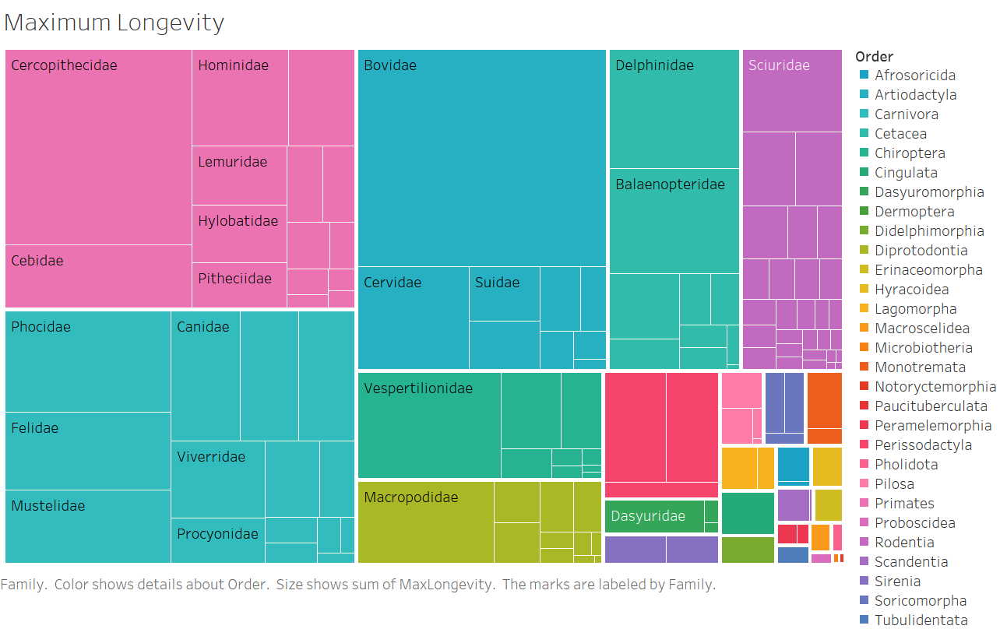
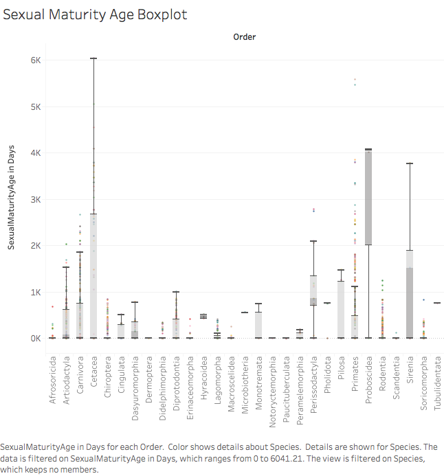
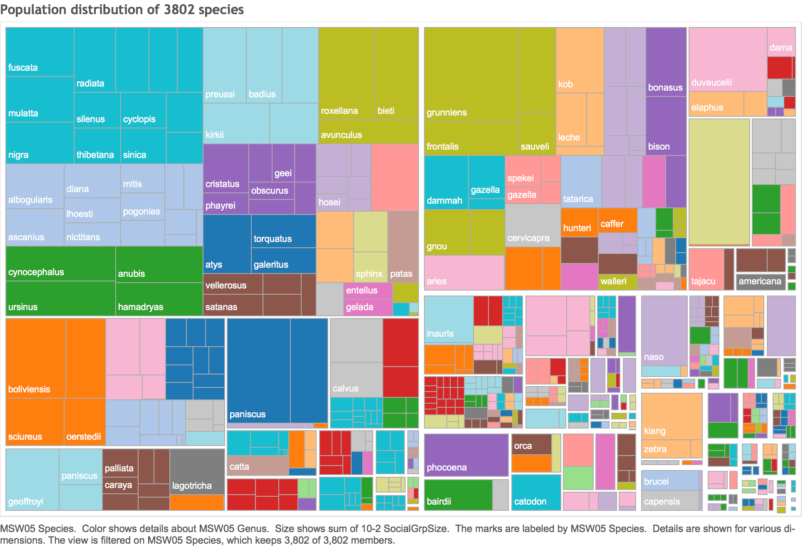

#**Introduction**
This is our R Notebook, showing the steps we took to complete Project3 for CS 329E. This notebook includes step-by-step instructions on how to reproduce our project. To obtain our data, we used esapubs.org, an online ecological archive containing data sets on analyses of life history, ecological, and geographic trait differences among species. In this project, we analyze the information on traits to look at patterns among orders and species. 

#**R Configuration**
Below we display our sessionInfo().

```{r sessionInfo}
sessionInfo(package=NULL)
```

#**Data Description**
All data were obtained through esapubs.org. The dataset, Pantheria, contains 100740 lines of biological data for extant and recently extinct mammalian species and was collect over a span of three years. All data came as one textfile, which we edited using Microsoft Excel.

#**Cleaning Data**
Here's our ETL file to clean our data set.

```{r}
source("../01 Data/R_ETL.pantheria.R")
```

#**Cleaned up Data Download**
Cleaned data can be downloaded from Data.world as a .csv file.

Hosting User: jlee
Database: s-17-edv-project-3
Dataset Name: Pantheria.csv

Download Link: https://query.data.world/s/a0v5q65c7q9ft4eubeyvs8wxb

```{r}
source("../01 Data/Access Dataworld dv3.R")
```

#**Tableau Generated Visualizations**
**Descriptions:** Refer to visualization captions for individual descriptions.

<br><br><br>
<br><br><br>
</center>
